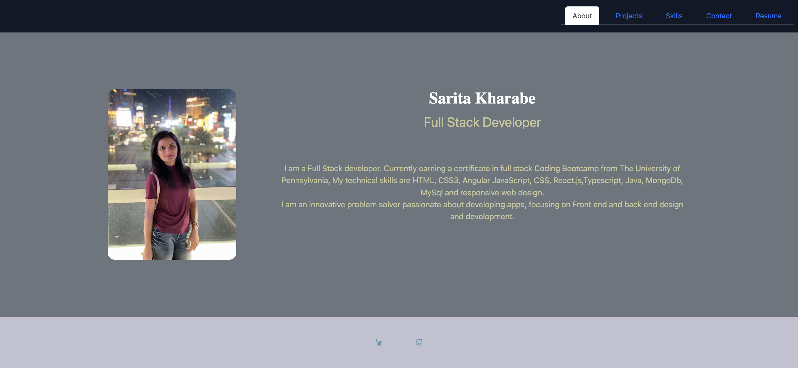

# sarita-react-portfolio

## Description 

This portfolio project is based on React-js and Javascript. In this project, i was motivated to create portfolio app to showcase my skills that I have learned working with ReactJs. 

In this projects, I have created a different companents. In the Navbar component I gave option ABout, Projects, Skills, Contact and Resume, so that anyone can move from one page to another page.

## Usage

When you first visit my portfolio site, the 'About' section will render first on screen. To view the 'Projects', 'Skills', 'Contact', and 'Resume' sections, click on the corresponding navigation tab.On the 'Project' page, if you click a the 'github' or 'deployedlink' of the project you will be redirected to the github page or deployed page . If you click on the GitHub, you will be redirected to the repo of that project on GitHub. On the 'Contact' page, there are input fields to enter your name, email, and a message. You will be notified if you fail to enter a field or if you enter an invalid email. The button under the form will send your message. On the 'Resume' page, my proficiences are listed. if you want to download my resume onto your device, just click on download button. Finally, there is a GitHub and LinkedIn icon as the footer on the page. If you click on one of these icons, you will be redirected to the site of that icon.

## Technology Used
* [React Js](https://react.dev/learn)

* [Javascript](https://developer.mozilla.org/en-US/docs/Web/JavaScript)

## Screenshot 

